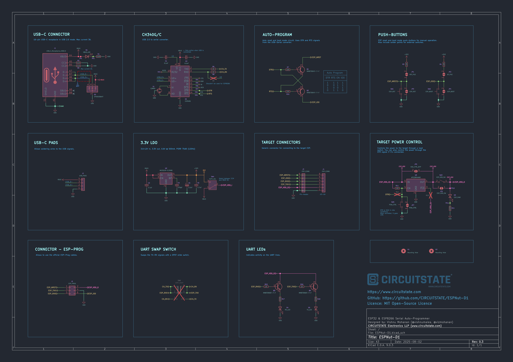
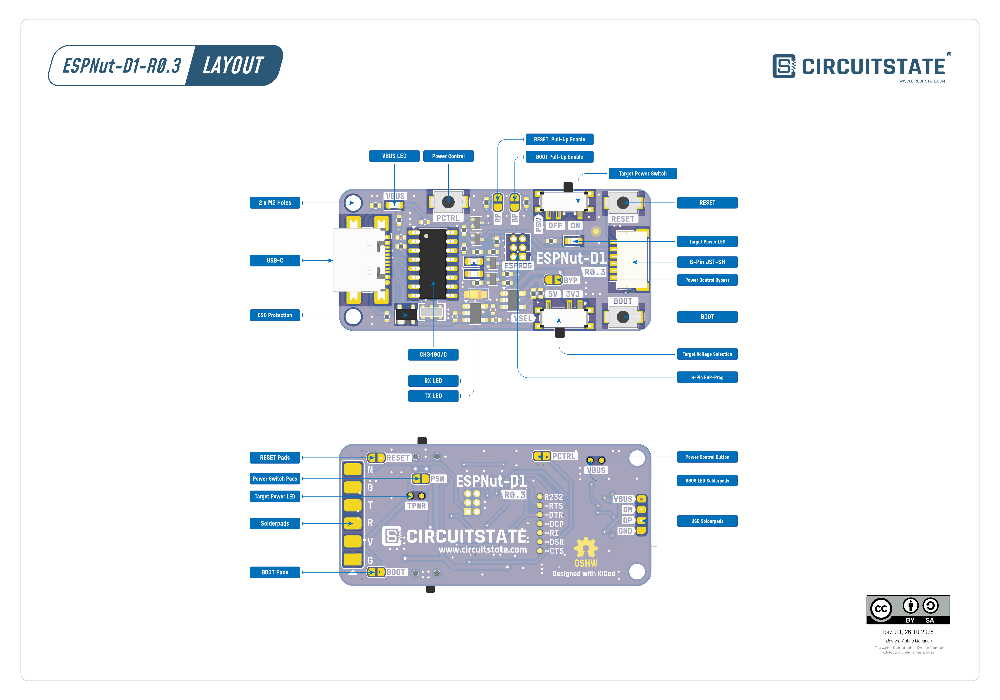
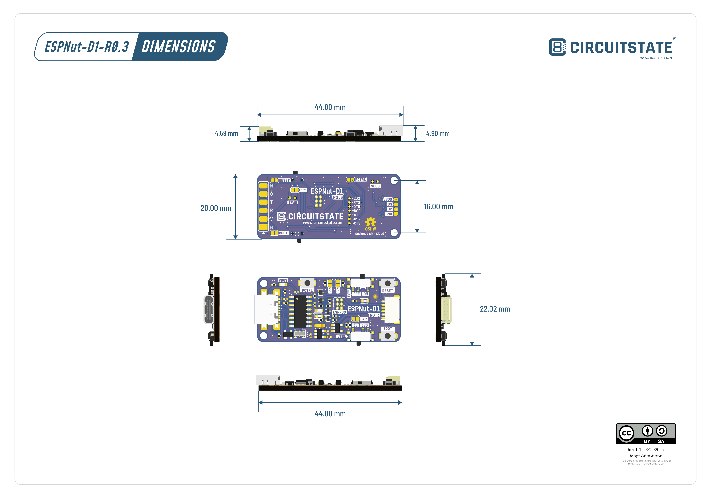

# ESPNut-D1 - R0.3

## Overview

[**ESPNut-D1**](https://github.com/CIRCUITSTATE/ESPNut-D1) (pronounced as **"ee yes peanut"**) is a single-channel USB-to-Serial converter and Auto-Programmer for the ESP32 & ESP8266 series microcontrollers from Espressif. While there exists many such programmers, ESPNut is a completely open-source hardware (OSHW) project designed in the **KiCad** open-source EDA tool. **D1** is the first design variant of this project. You can download the source files of this design, modify them and redistribute them as you wish.

ESPNut-D1 is based on the popular **CH340** series USB-to-Serial converter chip from *WCH*. The serial port of the chip connects to the target microcontroller through its own serial port. Thanks to the built-in serial bootloader of the ESP series microcontrollers, you can effortlessly program them at any time. The ESPNut-D1 makes this process a bit more convenient.

## Design

- **Parent Project:** ESPNut
- **Variant:** [ESPNut-D1](https://github.com/CIRCUITSTATE/ESPNut-D1)
- **Author:** Vishnu Mohanan (*@vishnumaiea*)
- **Revision:** `R0.3`
- **Layer Count:** 2
- **Thickness:** 1.6 mm
- **Dimensions:** 44 x 20 mm
- **EDA Tool:** KiCad V9
- **License:** MIT

## Features

- **CH340C/CH340G USB-to-Serial Converter**  
  Full-speed USB with up to 2 Mbps baud rate. No external crystal is required for when using the CH340C.
- **USB-C Connector**  
  Reversible 16-pin connector. Extra solderpads are provided for soldering wires.
- **Auto Bootloader and Reset**  
  Put the target ESP32/ESP8266 into bootloader mode and reset it automatically during programming.
- **Dedicated Reset & Boot Buttons**  
  For manually resetting the target or putting it into the bootloader mode.
- **On-Board LDO**  
  3.6~12V input, 3.3V output at maximum of 500 mA.
- **Target Power Switch**  
  Turn on and off the target power using a slide switch.
- **Electronic Load-Switch**  
  Control the power to the target using an electronic load-switch with a maximum current capability of 2.5A.
- **Target Voltage Selection Switch**  
  Use an SPDT slide switch for target voltage selection. Select between 3.3V and 5V.
- **Power Indication LEDs**  
  VBUS (5V) and target power indication LEDs.
- **UART Activity LEDs**  
  Indicates the activity on both the `TX` and `RX` lines.
- **Target Power Control**  
  Dedicated push-button for power control of the target. Useful for boards without reset pin.
- **Multiple Interfaces**  
  6-pin ESP-PROG 1.27 mm header.
  6-pin JST-SH connector and solderpad for target ESP.
- **Mechanical Mounting**  
  2x M2 mounting holes.

## Specifications

- **Product Name:** ESPNut-D1
- **USB-Serial Converter:** WCH CH340G/C
- **Power:**
    - **Input Range:** 5V
    - **USB-C:** 5V, 2A input
    - **3.3V LDO:** Max. 500 mA output
    - **Load Switch:** Max. 2.5A output
- **Interfaces:**
    - 1 x USB-C 2.0
- **Connectors:**
    - 1 x USB-C
    - 4 x 6-pin JST-SH for programming and communication
    - 1 x 6-pin ESP-PROG 1.27 mm header
- **Pads:**
    - 1 x 4-pin pads for USB-C connector
    - 1 x 6-pin pads for for programming and communication
    - 1 x 2-pin `RESET` pads for soldering the Reset button
    - 1 x 2-pin `BOOT` pads for soldering the Boot button
    - 1 x 2-pin `TPWR` pads for soldering the target power LED
    - 1 x 2-pin `PCTRL` pads for soldering the parget power control button
    - 1 x 2-pin `VBUS` pads for soldering the VBUS LED
    - 1 x 7-pin pads for CH340 breakout pins
    - 1 x 2-pin `BYP` solder-jumper for bypassing the load switch
    - 1 x 2-pin `RP` solder-jumper for enabling reset button pull-up resistor
    - 1 x 2-pin `BP` solder-jumper for enabling boot button pull-up resistor
- **Buttons:**
    - 1 x `RESET` button
    - 1 x `BOOT` button
    - 1 x `PCTRL` button for target power control
- **Switches:**
    - 1 x `VSEL` SPDT slide switch for target voltage selection
    - 1 x `PSW` power switch slide switch for target power control
- **LEDs:**
    - 1 x VBUS (5V) indicator LED
    - 1 x Target power indicator LED
    - 1 x `TX` activity LED
    - 1 x `RX` activity LED
- **Dimensions:** 44 x 20 mm
- **Mounting:** 30.5 x 30.5 mm (4 mm hole size)
- **Weight:** 9.35 g

## Pinout

### USB-C Solderpads

| Pin Number | Pin Name | Function      |
| :--------- | -------- | ------------- |
| 1          | `GND`    | Ground        |
| 2          | `DP`     | Data Positive |
| 3          | `DM`     | Data Minus    |
| 4          | `VBUS`   | 5V            |

### 6-pin JST-SH Connector / Solderpads

| Pin Number | Pin Name    | Function               |
| :--------- | ----------- | ---------------------- |
| 1          | `GND`       | Ground                 |
| 2          | `ESP_VDD_O` | Power for the target   |
| 3          | `ESP_TX0`   | ESP UART transmit pin  |
| 4          | `ESP_RX0`   | ESP UART receive pin   |
| 5          | `ESP_IO0`   | ESP GPIO0 (Boot Mode)  |
| 6          | `ESP_NRST`  | ESP Reset (Active Low) |

### ESP-PROG 1.27 mm Header

| Pin Number | Pin Name    | Function               |
| :--------- | ----------- | ---------------------- |
| 1          | `ESP_NRST`  | ESP Reset (Active Low) |
| 2          | `ESP_VDD_O` | Power for the target   |
| 3          | `ESP_TX0`   | ESP UART transmit pin  |
| 4          | `GND`       | Ground                 |
| 5          | `ESP_RX0`   | ESP UART receive pin   |
| 6          | `ESP_IO0`   | ESP GPIO0 (Boot Mode)  |

## Schematics

ESPNut-D1-R0.3 Schematic

- [Download Schematic [PDF]](../../../../assets/hardware/ESPNut/D1/R0.3/ESPNut-D1-R0.3-SCH-25102025-1.pdf)

## Layout

Following image shows the topology and components of the ESPNut-D1-R0.3 PCB.

ESPNut-D1-R0.3 Layout

- [Download Layout Drawing [PDF]](../../../../assets/hardware/ESPNut/D1/R0.3/ESPNut-D1-R0.3-Layout-Drawing-R0.1-CIRCUITSTATE-Electronics-1.pdf)

## Drawing

Following image shows the mechanical dimensions of the ESPNut-D1-R0.3 PCB. If you need more dimensions, please refer to the PCB design files or the STEP model.

ESPNut-D1-R0.3 Dimensions

- [Download Dimension Drawing [PDF]](../../../../assets/hardware/ESPNut/D1/R0.3/ESPNut-D1-R0.3-Dimension-Drawing-R0.1-CIRCUITSTATE-Electronics-1.pdf)

## Assembly Instructions

If you fabricate the PCB yourself, you can place and solder the components manually or use an automated assembly service. For manually assembly, the HTML BoM is extremely useful. The solder paste can be applied manually or using a stencil. For reflowing, you can use a hot plate or a reflow oven.

For automated assembly, you can use the Position or Centroid files for programming a pick-and-place (PnP) machine. A panelized PCB is better for automated assembly.

## Usage

ESPNut-D1 can function as both a USB-to-Serial UART converter as well as an ESP programmer. In addition, the ESPNut-D1 can also supply power to the target device and control it. If your target device expects a 5V supply, put the `VSEL` switch to the `5V` position. If it expects a 3.3V supply, put the `VSEL` switch to the `3.3V` position. Always set the output voltage before connecting the target device or USB power. If your target is externally powered, then you don't need to connect the power output of the ESPNut-D1 to the target. Only connects `GND` supplies together for a common ground. Regardless of the target supply voltage, all other signals from the ESPNut-D1 board will be at 3.3V logic levels. When the USB-C is connected, the `VBUS` LED will turn on. In case, the USB connector is damaged or not working, you can solder wires to the USB breakout solderpads.

When the power is supplied to the target through ESPNut-D1, you can turn it on or off using the `PSW` slide switch. The extra `PCTRL` button can momentarily disconnect the power to the target. This is useful for putting ESP boards without a RESET button into the bootloader mode. The power to the target is controlled through an electronic load switch. In case you want to bypass this feature, you can short the `BYP` solder-jumper. When the target power is on, the target power LED will turn on.

### USB-to-Serial Converter

The CH340G/C is a single channel USB 2.0 to serial UART converter with a maximum baud rate of 2 Mbps. To use ESPNut-D1 as a USB-Serial converter, simply connect it to your computer using a USB-C cable. The CH340 driver must be installed on your computer for it to be recognized properly. Once the driver is installed, the ESPNut-D1 will appear as a COM port (on Windows) or a `/dev/ttyUSBx` device (on Linux/Mac). Then you can use any serial terminal applications to send or receive data from a compatible microcontroller or device. The data will appear on the `TX` and `RX` pins of the 6-pin JST-SH connector or the solder pads. When there is active data transmission, the respective `TX` and `RX` activity LEDs will blink. For short burst of data, the LEDs may not blink visibly and it is as per design.

Even though normally not used, there are additional breakout pins for the CH340 chip on the PCB. You can find these pins as solder pads on the back side of the PCB.

### ESP Programmer

To use the ESPNut-D1 as an ESP programmer, you need to connect the target's `TX`, `RX`, `IO0` and `NRST` pins to the respective pins on the ESPNut-D1. Use cross-connection for the `TX` and `RX` pins. The target must be powered either from the ESPNut-D1 or from an external power supply. When both the `NRST` and `IO0` pins are available, the programmer can automatically put the target into the bootloader mode and reset it during programming. This is achieved with the auto-programming circuit recommended and used by *Espressif*. Additionally, you can also use the `RESET` and `BOOT` buttons on the ESPNut-D1 to manually reset the target or put it into the bootloader mode. Holding the `BOOT` button while pressing and releasing the `RESET` button will also put the target into the bootloader mode. If a RESET signal is not available on the target for some reason, you can perform the same operation using the `PCTRL` button to momentarily disconnect the power to the target while the `BOOT` button is pressed. After programming is complete, you can use the ESPNut-D1 as a normal USB-Serial converter to communicate with the target.

If your target board does not have pull-up resistors and causing issues, you can enable them by shorting the `RP` and `BP` solder jumpers. If your target board has an ESP-Prog connector, you can connect it directly to the ESPNut-D1 using a compatible cable. Otherwise, you can use the 6-pin JST-SH connector or solder pads to connect to the target. Supported targets are,

  * ESP8266
  * ESP8285
  * ESP32
  * ESP32-S2
  * ESP32-C3
  * ESP32-S3
  * ESP32-C6
  * ESP32-H2

## Troubleshooting

- **No power from the ESPNut-D1**  
  Check if the USB-C cable you are using is a proper and working one. Try a different cable or check the VBUS voltage with a multimeter.
- **Device does not show up on the computer**  
  Check if the drivers are installed properly. If not, download the drivers from the official website and install them.
- **Data is getting corrupted**  
  Try a lower baud rate. Long wires can cause data corruption at high baud rates. Try reducing the cable length.

## Known Issues

No known issues at this moment.

## Resources

- [ESPNut-D1 GitHub Repository](https://github.com/CIRCUITSTATE/ESPNut-D1)
- [ESPNut-D1-R0.3 Release](https://github.com/CIRCUITSTATE/ESPNut-D1)

